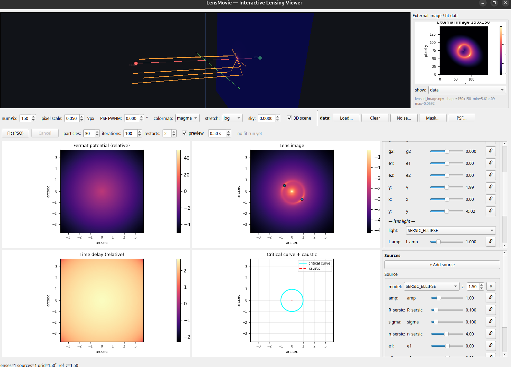

# LensMovie

An interactive Qt application that visualizes **gravitational lensing** with
[lenstronomy](https://lenstronomy.readthedocs.io/), re-rendered in real time as
you adjust parameters with sliders.



## Features
Single-window layout:
- **Top — 3D scene** (Vispy, GPU), full width and **edge-on** along the line of
  sight: `observer --------- lens plane(s) --------- source`. Each lens is a mass
  disk perpendicular to the line of sight, positioned along it by its redshift
  (balanced so observer / lenses / source are evenly spaced); light rays bend in
  the sky plane at each lens. Sources are drawn as **extended blobs** sized by
  their profile radius. The default camera is a side-on view (drag to rotate,
  scroll to zoom). The bar spans the full window width with a fixed height.
- **Display row**: the display settings share one row with the external-image
  file buttons (**Load… / Clear / Noise… / Mask… / PSF…**), visually separated into
  their own labelled `data:` group so they read as two distinct groups. The row
  scrolls horizontally on a narrow window instead of clipping.
- **Display strip**: grid size (numPix), colormap, log/linear stretch, and a
  **3D scene toggle**. Unchecking 3D stops rendering the scene (only the black
  background area remains — the layout does not reflow) and skips rebuilding it,
  which saves the per-update mesh construction / GL upload cost.
- **External image panel** (square, to the right of the 3D scene): load your own
  lensed-image matrix with **Load image…** and it is drawn with the same
  colormap/stretch. Supported inputs:
  `.npy` / `.npz`, `.fits` / `.fit` / `.fts` (first image HDU; a cube reduces to
  its first plane), `.mat`, `.txt` / `.csv` / `.dat` / `.tsv`, and image files
  `.png` / `.jpg` / `.tif` / `.bmp` (converted to luminance). The panel reports
  the loaded shape, value range and any conversion applied.
- **Fit the model to your data** (lenstronomy's own `FittingSequence`, PSO):
  a **Fit (PSO)** strip with particle / iteration / restart settings. The fit runs
  on a **background thread** (the GUI stays responsive) and only the **unlocked 🔓**
  parameters are varied — locked ones are held exactly. On completion the
  best-fit values are written back into the sliders, the strip reports
  `χ² initial → best (free, ndof)`, and the data panel can show
  **best-fit model** or **residual**.
  **You can watch it converge**: while the swarm runs, the data panel draws the
  current best model live (`fitting… iter i/N`, with the running χ² in the fit
  strip), so a long fit is not a black box. Preview rendering is optional and
  rate-limited — a **preview** checkbox plus an interval (default `0.5 s`).
  Measured cost is negligible either way (a 200-iteration fit took 10.7 s with
  previews off vs 10.0–10.3 s at every 0.1–2 s, i.e. within run-to-run noise), so
  it can normally be left on; uncheck it on a slow machine for the guaranteed
  minimum work.
- **Fit-data layer** (inputs for the fit):
  - **pixel scale** (`arcsec/px`) is a control in the display strip and drives the
    model grid, so model and data can share one grid.
  - **PSF**: a Gaussian `FWHM` control, or load a PSF **kernel** file.
    `FWHM = 0` keeps the default delta PSF.
  - **Load noise / mask** (same-shape files) for a proper chi-squared likelihood.
  - **“preview on model grid”** resamples the loaded data onto the model grid
    (pixel scale + centre) so the alignment can be verified; the label then
    reports the grid, resampling, noise, mask coverage and PSF.
- **Lower half — a 2-row x 3-column grid**:
  | | col 1 | col 2 | col 3 |
  |---|---|---|---|
  | row 1 | Fermat potential | Lens image (+ image positions) | **Lenses** config |
  | row 2 | Time delay | Critical curve + caustic | **Sources** config |
- **Config panels**:
  - **Multiple lenses**: each with model selection (SIS / SIE / PEMD), own
    parameters (theta_E, shear, ellipticity, center) and **redshift**; add/remove.
  - **Deflector (lens galaxy) light per lens**: a light-model selector
    (`NONE` / `SERSIC_ELLIPSE` / `SERSIC` / `GAUSSIAN_ELLIPSE` / `GAUSSIAN`) with
    its own amplitude, size, Sersic index, ellipticity and Gaussian sigma. This
    light sits in the image plane and is **not lensed**. It matters for real data:
    without it the deflector's light would be absorbed into the source by a fit.
    Its sliders are disabled while the model is `NONE`.
  - **Sky background**: a constant pedestal added to the model image (display strip).
  - **Multiple sources** — all **extended (resolved)** profiles, selectable per
    source: `SERSIC_ELLIPSE`, `SERSIC`, `GAUSSIAN_ELLIPSE`, `GAUSSIAN`, each with
    position, ellipticity, size (`R_sersic` / `sigma`), `n_sersic` and
    **redshift**; add/remove.
  - Physics via lenstronomy **multi-plane** lensing; one source-plane redshift is
    used as the reference for the 2D scalar fields.
  - **Every parameter is slider _and_ numeric input**: each slider has an editable
    number box beside it, so you can drag for a quick feel or type an exact value
    (the box carries one more decimal than the slider's step). The typed value is
    what the model and any fit use, so precision is not lost to the slider's snap.
  - **Fix (lock) button per parameter**: the 🔓 button beside every lens/source
    slider locks that parameter. A fixed parameter cannot be changed by anything
    — the slider is disabled, the value is frozen, and even programmatic updates
    are rejected. Only the user can release it, by clicking the same button (the
    API enforces this: unfixing requires an explicit ``user=True``).
- Debounced throttled redraw keeps slider dragging smooth.
- All four 2D canvases share one figure size + Expanding size policy, so the grid
  stays aligned and each canvas fills its cell on resize.
- If Vispy/OpenGL is unavailable, the app degrades gracefully to 2D-only.

## Requirements
The app is developed against a conda environment named `lenstronomy_env`:

```
python >=3.9
numpy, scipy, matplotlib, PyQt5, lenstronomy, vispy
```

## Run
Run from the project root with `python -m` so the `app` package is importable:

```bash
cd /home/cyan/Documents/GitHub/LensMovie
conda run -n lenstronomy_env python -m app.main

# or, after editable install (pip install -e .), from anywhere:
#   conda run -n lenstronomy_env lensmovie
```

## Tests
Run from the project root (again, `-m` matters):

```bash
cd /home/cyan/Documents/GitHub/LensMovie
conda run -n lenstronomy_env python -m pytest tests/ -q
```
(UI smoke tests use the offscreen Qt platform and run without a display; the 3D
scene needs a live OpenGL context and is covered by a smoke run with a display.)

## Project layout
```
app/
  main.py          # entry point
  main_window.py   # main window: top row (3D + external image), 2x3 grid
  controls.py      # LensesPanel + SourcesPanel + DisplayBar + DataBar + FitBar
  plotting.py      # matplotlib canvases (Field/Image/Curves/External)
  lensing_calc.py  # lenstronomy physics core (multi-plane, fields, cc/caustic)
  scene3d.py       # vispy -> edge-on 3D scene
  external_image.py# load user-supplied matrices (npy/fits/mat/text/images)
  fit_data.py      # resample data/noise/mask onto the model grid + chi2
  fitting.py       # build FittingSequence inputs, run PSO (locks -> kwargs_fixed)
  fit_worker.py    # QThread wrapper so a fit does not block the GUI
img/               # screenshots and generated test data
tests/
DESIGN.md
```

## License
MIT
